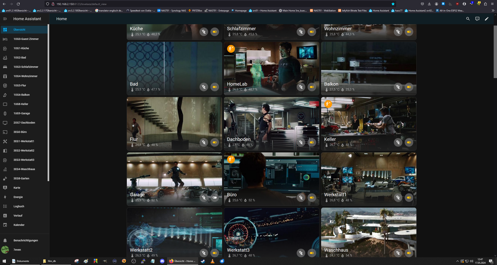
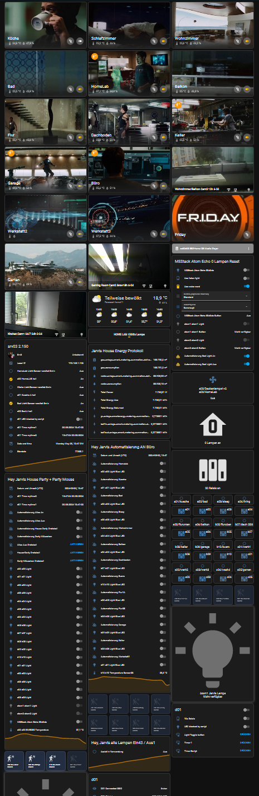
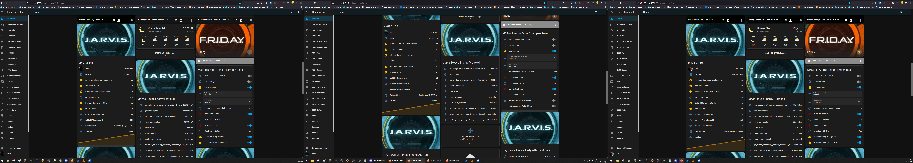

haos2024.05main 20.05.2024

# haos2024.05/tree/main - yaml esphome files 
### note: source dev

### note: source dev az-esp32v4 (pcb) 

# haos v1.2.3 dashboard home panel overview env

## note: haos esphome devices panel overview

# env.0 az32 = home lab (guest_room)

### button + 4xrelais(incl led) + dht11 + ultrasonic
### note: value id temp + humi + ultraschall
### <a href="https://github.com/7even2023/yaml/blob/76fa6ba39aad9fe83afc449854af3aca2f6d9836/ch0-001_esphome-web-e911d0.yaml">ch0-000_esphome-az32.yaml</a>

# env.1 az32001 = küche (kitchen)

### button + relais(incl led) + dht11 + lcd
### note: value id temp + humi 
### <a href="https://github.com/7even2023/yaml/blob/76fa6ba39aad9fe83afc449854af3aca2f6d9836/ch0-001_esphome-web-e911d0.yaml">ch1-001_esphome-az32001.yaml</a>

# env.2 az32002 = bad (bath)

### button + relais(incl led) + dht11 
### <a href="https://github.com/7even2023/yaml/blob/76fa6ba39aad9fe83afc449854af3aca2f6d9836/ch0-001_esphome-web-e911d0.yaml">ch1-002_esphome-az32002.yaml</a>

# env.3 az32003 = schlafzimmer (sleeping_room)

### button + relais(incl led) + dht11 
### <a href="https://github.com/7even2023/yaml/blob/76fa6ba39aad9fe83afc449854af3aca2f6d9836/ch0-001_esphome-web-e911d0.yaml">ch1-003_esphome-az32003.yaml</a>

# env.4 az32004 = wohnzimmer (living_room)

### relais(incl led) + dht11 
### <a href="https://github.com/7even2023/yaml/blob/76fa6ba39aad9fe83afc449854af3aca2f6d9836/ch0-001_esphome-web-e911d0.yaml">ch1-004_esphome-az32004.yaml</a>

# env.5 az32005 = flur (todo motion) wip motion(ir)

###  neopixel rgb light (relais(incl led) + fotosensor + thermistor) 
### <a href="https://github.com/7even2023/yaml/blob/76fa6ba39aad9fe83afc449854af3aca2f6d9836/ch0-001_esphome-web-e911d0.yaml">ch1-005_esphome-az32005rgb.yaml</a>

# env.6 cb32 = balkon (outside/aussen)

### relais(incl led) + dht11 
### <a href="https://github.com/7even2023/yaml/blob/76fa6ba39aad9fe83afc449854af3aca2f6d9836/ch0-001_esphome-web-e911d0.yaml">chx-00x_esphome-cb32.yaml</a>

wip-changelog261123-1234: 
todo fix hyperlinks in readme to yaml perma file links 
todo add v1.1 code balkon=outside/aussen wohnzimmer env4+7 splitt
wip-changelog281123-1644: 
added flur rgb only
todo add alle Schaltpläne
