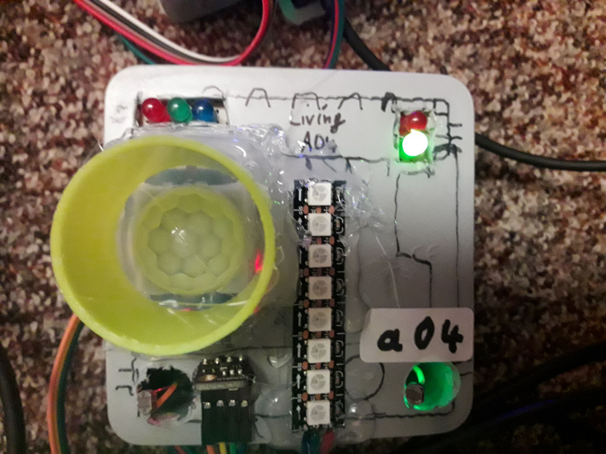

haos2024.05main 20.05.2024 13:27

# haos2024.05/tree/main - yaml main esphome files 
### note: source main (srv7@6wlan) 

Home Assistant 2024 05 20 2xwlan 

Video: 

https://www.youtube.com/watch?v=jPW5DhYZHiI

# haos2024.05/tree/dev - yaml backup esphome files 
### note: source dev (srv7@6wlan) 

# haos v1.2.3 dashboard home panel env.overview (srv1+srv2+srv7@6+7wlan) 

# env.0 az32a00 = home lab (guest_room)

env: button + relais(incl led) + bme280 id temp + humi + press
### <a href="https://github.com/7even2023/yaml/blob/76fa6ba39aad9fe83afc449854af3aca2f6d9836/ch0-001_esphome-web-e911d0.yaml">az32a00.yaml</a>

# env.1 az32a01 = kueche (kitchen)

env: button + relais(incl led) + bme280 id temp + humi + press
### <a href="https://github.com/7even2023/yaml/blob/76fa6ba39aad9fe83afc449854af3aca2f6d9836/ch0-001_esphome-web-e911d0.yaml">az32a01.yaml</a>

# env.2 az32a02 = bad (bath)

env: button + relais(incl led) + bme280 id temp + humi + press
### <a href="https://github.com/7even2023/yaml/blob/76fa6ba39aad9fe83afc449854af3aca2f6d9836/ch0-001_esphome-web-e911d0.yaml">az32a02.yaml</a>

# env.3 az32a03 = schlafzimmer (sleeping_room)

env: button + relais(incl led) + bme280 id temp + humi + press
### <a href="https://github.com/7even2023/yaml/blob/76fa6ba39aad9fe83afc449854af3aca2f6d9836/ch0-001_esphome-web-e911d0.yaml">az32a03.yaml</a>

# env.4 az32a04 = wohnzimmer (living_room)

env: button + relais(incl led) + bme280 id temp + humi + press
### <a href="https://github.com/7even2023/yaml/blob/76fa6ba39aad9fe83afc449854af3aca2f6d9836/ch0-001_esphome-web-e911d0.yaml">az32a04.yaml</a>

# env.5 az32a05 = flur (todo motion a05-b05) wip(pir)

env: button + relais(incl led) + bme280,fotosensor,pir,ultrasonic  
### <a href="https://github.com/7even2023/yaml/blob/76fa6ba39aad9fe83afc449854af3aca2f6d9836/ch0-001_esphome-web-e911d0.yaml">az32a05.yaml</a>

# env.6 az32a06 = balkon (outside/aussen)

env: button + relais(incl led) +temp1=bme280 +temp2=dht11 
### <a href="https://github.com/7even2023/yaml/blob/76fa6ba39aad9fe83afc449854af3aca2f6d9836/ch0-001_esphome-web-e911d0.yaml">az32a06.yaml</a>

wip-changelog200524-1437: 

todo hyperlinks in readme to yaml file links 

overview env location w.i.p. (location:ort)  az-esp32v4

overview env connected w.i.p. (speed:verbindung) mesh-wifi

wip-changelog200524-1601: 

todo add all yaml-projects in git-source
### <a href="https://github.com/7even2023/haos2024.05/blob/main/git-source/">git-source = all files</a>

todo add flur part unten b05 
