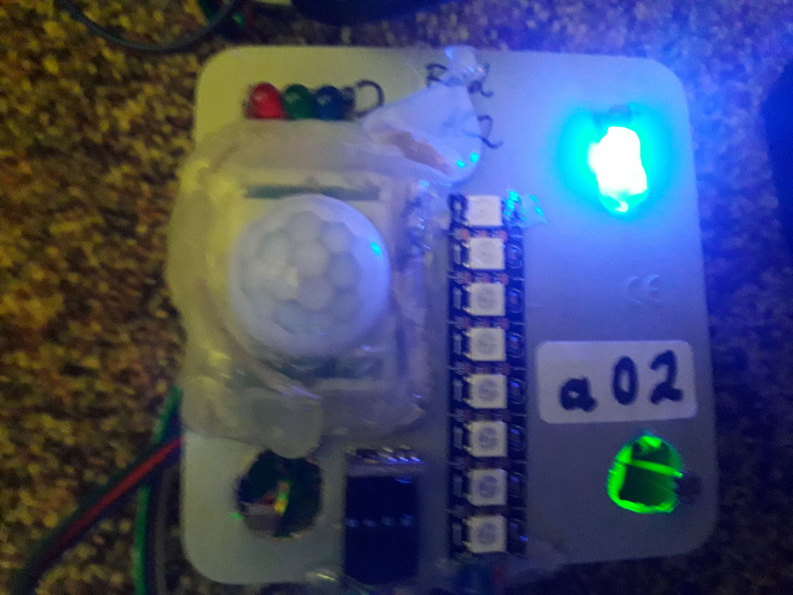

haos2024.05main 20.05.2024 13:27

# haos2024.05/tree/main - yaml main esphome files 
### note: source main (srv7@7wlan) 

# haos2024.05/tree/dev - yaml backup esphome files 
### note: source dev (srv7@6wlan) 

# haos v1.2.3 dashboard home panel env.overview (srv1+srv2+srv7@7wlan) 

 overview env location w.i.p. (location:ort)  az-esp32v4

  overview env connected w.i.p. (speed:verbindung) mesh-wifi

# env.0 az32a00 = home lab (guest_room)

pcb: button + relais(incl led) + bme280
note: value id temp + humi + press
### <a href="https://github.com/7even2023/yaml/blob/76fa6ba39aad9fe83afc449854af3aca2f6d9836/ch0-001_esphome-web-e911d0.yaml">az32a00.yaml</a>

# env.1 az32a01 = kueche (kitchen)

pcb: button + relais(incl led) + bme280
note: value id temp + humi + press
### <a href="https://github.com/7even2023/yaml/blob/76fa6ba39aad9fe83afc449854af3aca2f6d9836/ch0-001_esphome-web-e911d0.yaml">az32a01.yaml</a>

# env.2 az32a02 = bad (bath)

pcb: button + relais(incl led) + bme280
note: value id temp + humi + press
### <a href="https://github.com/7even2023/yaml/blob/76fa6ba39aad9fe83afc449854af3aca2f6d9836/ch0-001_esphome-web-e911d0.yaml">az32a02.yaml</a>

# env.3 az32a03 = schlafzimmer (sleeping_room)

### button + relais(incl led) + dht11 
### <a href="https://github.com/7even2023/yaml/blob/76fa6ba39aad9fe83afc449854af3aca2f6d9836/ch0-001_esphome-web-e911d0.yaml">ch1-003_esphome-az32003.yaml</a>

# env.4 az32a04 = wohnzimmer (living_room)

### relais(incl led) + dht11 
### <a href="https://github.com/7even2023/yaml/blob/76fa6ba39aad9fe83afc449854af3aca2f6d9836/ch0-001_esphome-web-e911d0.yaml">ch1-004_esphome-az32004.yaml</a>

# env.5 az32a05 = flur (todo motion) wip motion(ir)

###  neopixel rgb light (relais(incl led) + fotosensor + thermistor) 
### <a href="https://github.com/7even2023/yaml/blob/76fa6ba39aad9fe83afc449854af3aca2f6d9836/ch0-001_esphome-web-e911d0.yaml">ch1-005_esphome-az32005rgb.yaml</a>

# env.6 az32a06 = balkon (outside/aussen)

### relais(incl led) + dht11 
### <a href="https://github.com/7even2023/yaml/blob/76fa6ba39aad9fe83afc449854af3aca2f6d9836/ch0-001_esphome-web-e911d0.yaml">chx-00x_esphome-cb32.yaml</a>

wip-changelog200524-1437: 
todo hyperlinks in readme to yaml file links 

wip-changelog200524-1438: 
added flur part unten b05 + wip rgb stripe 5m 
todo add all yaml-projects in git-source
