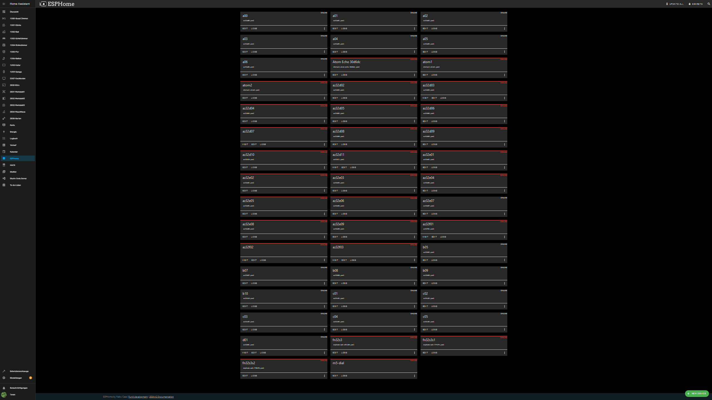

haos2024.05main/git-source  20.05.2024 15:54

# haos2024.05/tree/main/git-source - yaml all esphome files 
### note: source main + _fonts + _icons

# haos v1.2.3 dashboard home panel env.overview (srv1+srv2+srv7@7wlan) 

wip-changelog200524-1558: 

overview env 

wip-changelog200524-1559: 

todo add all yaml-projects in git-source

